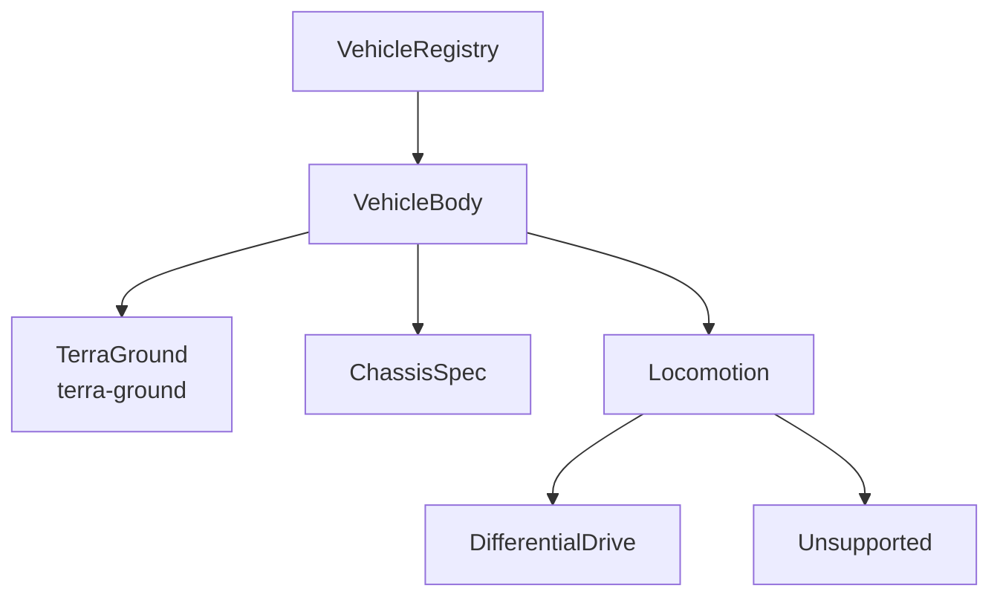

# API

!!! tip "TL;DR"
    Published rustdoc is one crate: `zorvane-vehicle`.
    It has no dependencies.
    The simulator binary is not in that rustdoc.



*Select a body. This build can drive `DifferentialDrive` only.*

[Open zorvane-vehicle rustdoc](https://super-yojan.dev/Zorvane/api/zorvane_vehicle/index.html)

The docs workflow runs:

```sh
cargo doc --locked --no-deps -p zorvane-vehicle
```

It copies `target/doc` to `/api/` on the site.

The `zorvane` package is a binary. Its modules stay private. Documenting it would compile Bevy and the Terra git crates, so the docs job skips it.

How to add a body: [Vehicle bodies](reference/vehicles.md).
