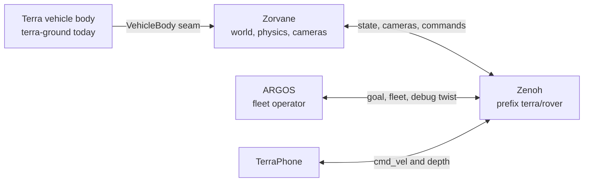

# Zorvane

Zorvane is the world simulator. It runs the terrain, physics, cameras, and the Zenoh bridge that [ARGOS](https://super-yojan.dev/ARGOS/) and [Terra](https://super-yojan.dev/Terra/) already speak. Terra is the vehicle body and the onboard stack, including TerraPhone. ARGOS is the fleet operator. This repository is the world those two meet in.

The site is part of [super-yojan.dev](https://super-yojan.dev). Source: [Super-Yojan/Zorvane](https://github.com/Super-Yojan/Zorvane).

## Where it sits

A Terra body plugs into the simulator through `zorvane-vehicle`. The simulator then publishes and subscribes on the Zenoh prefix `terra/rover`, the same prefix TerraPhone and ARGOS use for a real rover. The default listen address is `tcp/127.0.0.1:7447`. No separate Zenoh router is required.

Shared robotics crates (`terra-types`, `terra-control`, `terra-waypoint`, `terra-transport`, mapping, navigation, autonomy, experiment) stay in Terra. Zorvane pins them as git dependencies in the workspace `Cargo.toml`. Terra's motor and actuator crates stay there too. The collider and `rover.glb` that the simulator drives live here as the `terra-ground` body.

## What is in this repo

| Path | Role |
| --- | --- |
| `simulator/` | Bevy and Avian world. Binary name `zorvane`. |
| `crates/zorvane-vehicle/` | `VehicleBody` and `VehicleRegistry`. |
| `simulator/tools/zenoh_client.py` | Python client for drive, goal, fleet, and frames. |
| `docker/` | Headless image that listens on port 7447. |

## Read next

- [Running](running.md) covers a window, a headless smoke run, and Docker.
- [Worlds](worlds.md) covers the practice town, Terrarium tiles, and the NEXT pitch.
- [Vehicle bodies](reference/vehicles.md) is the seam, including how a later body is registered.
- [Zenoh](reference/zenoh.md) is the `terra/rover` contract.
- [Python client](python-client.md) drives rover 0 from another terminal.
- [Migration from Terra](reference/migration.md) is the delete list for the Terra repository.
- [API](api.md) is the rustdoc for `zorvane-vehicle`.

## Planned

These names exist so later work has a place to land. This build does not perform them.

- **Other locomotion.** `Locomotion::Unsupported` can be registered, and selecting it aborts startup with the reason string. A drone actuator model is the intended next variant. The registry test double `placeholder-drone` is not registered in `VehicleRegistry::from_id`.
- **Robot import.** Terra's easy-import and flexible-actuator work is a separate project. This repository does not load URDF or invent an actuator graph.
- **NEXT match play.** `TERRA_NEXT=1` is a practice pitch with tennis balls and two deposit buckets. It is a clean layout, and it does not score a match.
- **Full GIS world.** Tiles are a local elevation patch. Vector roads, live imagery, and a multi-kilometre streamed world are out of scope. See the [town and tiles](reference/world.md) page.
