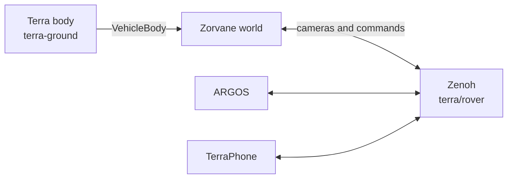

# Zorvane

!!! tip "TL;DR"
    Zorvane is the world.
    [Terra](https://super-yojan.dev/Terra/) is the vehicle.
    [ARGOS](https://super-yojan.dev/ARGOS/) is the operator.
    They meet on Zenoh, prefix `terra/rover`, port `7447`.

*Default run. One `terra-ground` rover at the town intersection.*

Part of [super-yojan.dev](https://super-yojan.dev). Source: [Super-Yojan/Zorvane](https://github.com/Super-Yojan/Zorvane).

## Pick a world

*Real elevation. `TERRA_TILES=1`. Grey boxes are steep cells.*

*Competition practice. `TERRA_NEXT=1`. Zatara, six balls, two buckets.*

| Switch | You get |
| --- | --- |
| *(none)* | Practice town, 100 m |
| `TERRA_TILES=1` | Elevation patch around a map anchor |
| `TERRA_NEXT=1` | NEXT pitch, 32 m |

More on [Worlds](worlds.md).

## Who talks to whom

*The body plugs in. Operators use the same keys as a real rover.*

Shared crates stay in Terra: types, control, waypoint, transport, autonomy. Motors stay there too. The collider and `rover.glb` live here.

## Planned

!!! note "Not in this build"
    A drone can be registered as `Locomotion::Unsupported`. Startup then stops.
    URDF import is a later Terra project.
    The NEXT pitch does not score a match.
    Tiles are one local patch, not a streamed GIS world.
