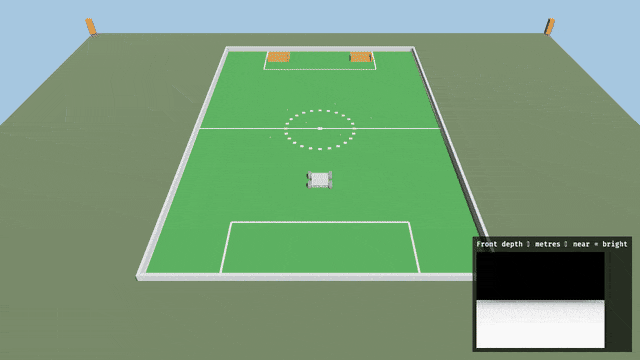
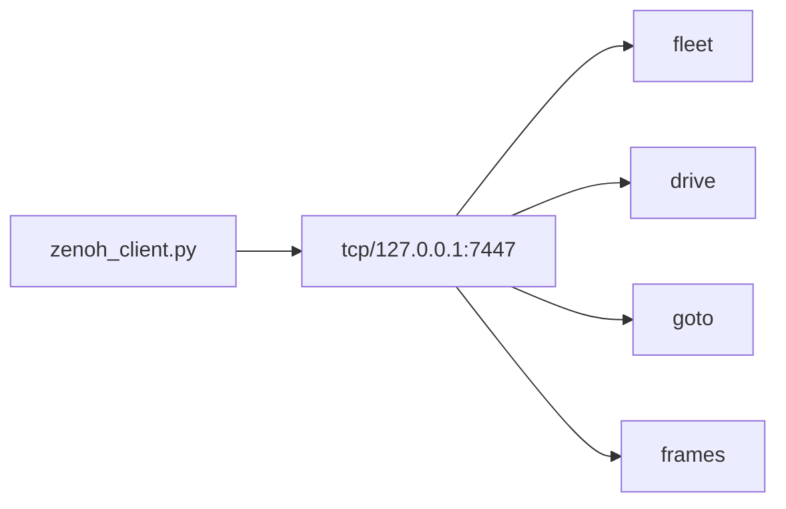
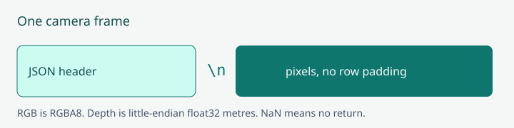

# Python client

!!! tip "TL;DR"
    Install `eclipse-zenoh` and `numpy`.
    Start Zorvane first.
    Then `python3 simulator/tools/zenoh_client.py`.
    It connects to `tcp/127.0.0.1:7447`. It does not start a router.



*`drive` publishes that same forward twist, 20 times a second, then sends zeros.*



*Four subcommands. Prefix defaults to `terra/rover`. Rover defaults to 0.*

```sh
python3 -m pip install -r simulator/tools/requirements.txt
python3 simulator/tools/zenoh_client.py --help
```

| Flag | Default |
| --- | --- |
| `--endpoint` | `tcp/127.0.0.1:7447` |
| `--prefix` | `terra/rover` |
| `--rover` | `0` |

Commands for an id that is not spawned are ignored.

## fleet

```sh
python3 simulator/tools/zenoh_client.py fleet
python3 simulator/tools/zenoh_client.py fleet --count 3
```

`--count` is 0 through 32. The client waits up to 5 seconds for `fleet/state`.

## drive

```sh
python3 simulator/tools/zenoh_client.py --rover 0 drive --linear 0.4 --angular 0 --seconds 2
```

Linear is m/s forward. Positive angular is a left turn, rad/s.
A latched goal ignores twists until you cancel it.
Silence for 500 ms also stops the rover.

## goto

One publish. Then status lines until `arrived`, or `idle` after `--cancel`.
Timeout is 45 seconds.

```sh
python3 simulator/tools/zenoh_client.py --rover 0 goto --x 12 --y -4
python3 simulator/tools/zenoh_client.py --rover 0 goto --lat 38.82981 --lon -77.3075 --token gmu-north
python3 simulator/tools/zenoh_client.py --rover 0 goto --cancel
```

Use `--x` and `--y`, or `--lat` and `--lon`, or `--cancel`.
A latitude goal needs a tile anchor. Local `x` is north of that anchor. `y` is west.

Shapes and the 2048-byte cap: [Zenoh](reference/zenoh.md#go-to-waypoint).

## frames

```sh
python3 simulator/tools/zenoh_client.py --rover 0 frames --output /tmp/terra-frames
```

`--all` subscribes to every rover.
Each rover directory gets `rgb.npy`, `depth.npy`, JSON, and an RGB PPM.

RGB is `(height, width, 4)` uint8. Depth is `(height, width)` float32 metres. NaN means no return.

Packet layout: [Zenoh](reference/zenoh.md). The sensor: [Depth camera](reference/depth-camera.md).



*Header, newline, then tightly packed pixels.*
