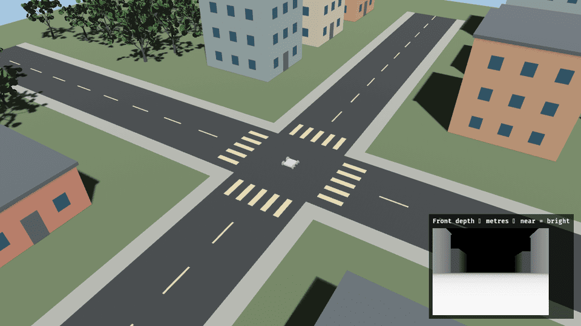
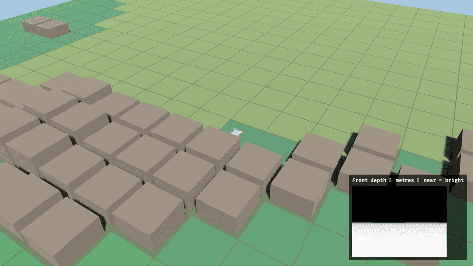
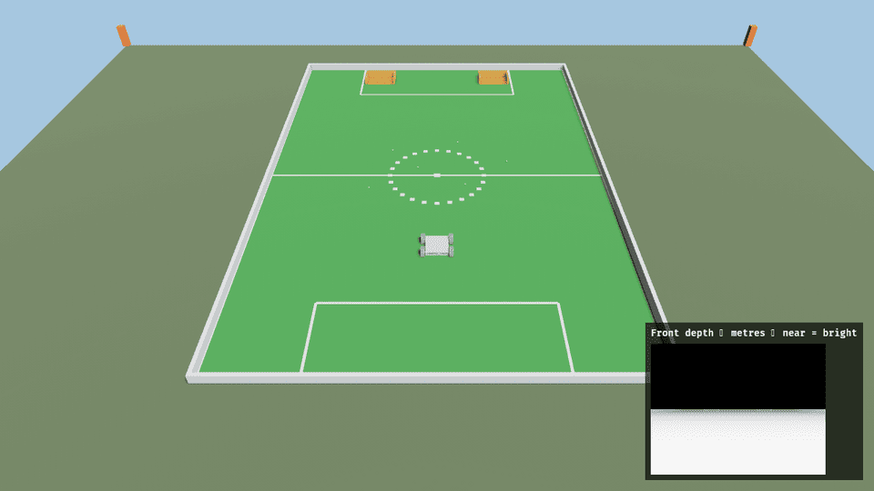

# Worlds

!!! tip "TL;DR"
    No flag: practice town.
    `TERRA_TILES=1`: real elevation.
    `TERRA_NEXT=1`: NEXT pitch. This one wins over the others.



*100 m town. Seed 42. Rover starts at the intersection.*



*Johnson Center anchor. Flat collider. Steep cells become grey boxes.*



*32 m square. Zatara faces two buckets. Six tennis balls.*

| Order | Switch | Layout |
| --- | --- | --- |
| 1 | `TERRA_NEXT=1` | Pitch. Tiles and mission rubble stay off. |
| 2 | `TERRA_MISSION=1` | Flat 100 m square and seeded rubble. |
| 3 | `TERRA_TILES=1` | Elevation around the anchor. A failed load falls back to the town. |
| 4 | none | Practice town. |

Startup prints `Zorvane vehicle: Terra (terra-ground)`.
Tiles add a `Terra tiles:` line. NEXT adds a `Terra NEXT:` line.

## Town

Two roads. Twelve buildings. Up to 96 trees. A pond. Voxel hills outside the square.

Buildings, trunks, pond borders, and hills have colliders. The pond has no buoyancy.

`TERRA_MISSION_SEED` replaces seed 42. The same seed rebuilds the same town. Width stays between 40 m and 512 m.

Detail and the tile math: [Town and tiles](reference/world.md).

## Tiles

```sh
TERRA_TILES=1 TERRA_TILES_FETCH=0 cargo run -p zorvane
```

Default anchor: George Mason University Johnson Center, `38.8297`, `-77.3075`, zoom 15.
That tile is in the repo, so fetch can stay off.

The rover locks roll and pitch. The ground collider stays flat. A box appears where neighbour slope exceeds 0.35, except within 3 m of the spawn.

`x` is north. `y` is west. Yaw 0 faces north.

## NEXT

```sh
TERRA_NEXT=1 cargo run -p zorvane
```

Zatara is spawn slot 0 of `terra-ground`. Same chassis. New name.

Push a ball into a bucket. Past the mouth, a pull holds it against the back wall.
The opening is wider than the rover. The scene does not keep score.

Field notes: [NEXT field](reference/next.md).

## Mission rubble

`TERRA_MISSION=1` drops a few static boxes on a flat 100 m square. Seed 42.
`TERRA_NEXT=1` skips that layout.

The arbiter still lives in Terra. Logs are JSONL under `TERRA_RUN_DIR` (default `runs`).
