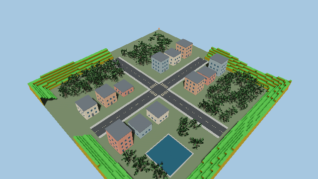

# Zorvane world

This world simulator moved out of Terra. Run it from the Zorvane repository
root with `cargo run -p zorvane`. `TERRA_*` environment variables and the
`terra/rover/…` Zenoh keys are unchanged. The chassis is the `terra-ground`
vehicle; see [VEHICLES.md](../VEHICLES.md).

`TerraWorldPlugin::default()` creates a 100 m square practice environment:

- Two connected roads with dashed lane markings, sidewalks and crosswalks.
- Twelve buildings with seeded heights, windows and doors.
- Up to 96 procedural trees, with eight shared mesh variants.
- A small animated pond with stone borders.
- Voxel hills around the outside of the map.

The first rover starts at the clear intersection. Additional rovers spawn along
the roads; see [ZENOH.md](ZENOH.md) for configurable fleet size and remote control. Buildings, tree trunks, pond borders
and voxel hill meshes have static Avian colliders. Roads sit on the flat ground
collider. Leaves and branches are visual geometry; water has no buoyancy model.
The pond is a surface over the flat ground, rather than an excavated basin.

## Configuration

Pass a `WorldConfig` to `TerraWorldPlugin`, for example:

```rust
TerraWorldPlugin {
    config: WorldConfig {
        size: 100.0,
        landscape: LandscapeConfig {
            seed: 123,
            tree_count: 120,
            road_width: 6.0,
            pond: true,
            voxel_hills: true,
            ..default()
        },
        ..default()
    },
}
```

Import `world::WorldConfig` and `landscape::LandscapeConfig`. Set
`landscape.enabled = false` for the previous flat practice world; set
`show_grid = true` to display its grid. Landscape sizes are limited to 40–512 m.
Dense tree requests may produce fewer trees to preserve clearance and spacing.
Identical seeds reproduce building heights, tree placement, meshes, and hills.

## Libraries

- [bevy_voxel_world](https://github.com/splashdust/bevy_voxel_world), version
  0.17.0: streams the perimeter hills and generates mesh-matched colliders.
- [bevy_procedural_tree](https://github.com/Affinator/bevy_procedural_tree),
  version 0.4.0: generates branching trunks and leaf meshes.
- [bevy_water](https://crates.io/crates/bevy_water), version 0.18.1: supplies
  the pond material and wave animation, using the local Bevy 0.19 port described
  in `vendor/bevy_water/TERRA_PORT.md`.
- [bevytiles](https://crates.io/crates/bevytiles), version 0.1.0: supplies web-mercator
  anchoring (`WorldConfig::from_lat_lon`), Terrarium `HeightGrid` sampling, and the
  tile fetcher used by the optional real-world patch below. The default practice
  world still installs a flat local grid so elevation queries match the ground
  collider without a network.

## Real-world tiles

`TERRA_TILES=1` replaces the practice town with a square of real elevation. The
flat world stays the default, and a failed load prints the reason and continues
with that flat world.

```sh
cd simulator
TERRA_TILES=1 cargo run
TERRA_TILES=1 TERRA_LAT=38.8340 TERRA_LON=-77.3120 TERRA_ZOOM=15 cargo run
TERRA_TILES=1 TERRA_TILES_FETCH=0 cargo run   # bundled tile or TERRA_TILE_CACHE only
```

| Variable | Default | Purpose |
| --- | --- | --- |
| `TERRA_TILES` | off | `1` or `true` selects the tile world |
| `TERRA_LAT` / `TERRA_LON` | 38.8297, -77.3075 | Anchor, decimal degrees (GMU Johnson Center) |
| `TERRA_ZOOM` | 15 | Slippy zoom, 9 through 15. 15 is the native Terrarium zoom, about 4 m per sample |
| `TERRA_TILES_FETCH` | on | `0` refuses HTTP and uses the cache or the bundled tile |
| `TERRA_TILE_CACHE` | `simulator/.cache/tiles` | bevytiles cache layout `heightmap/<z>/<x>/<y>.png` |
| `TERRA_WORLD_SIZE` | 100 | Patch width in metres, 40 through 512 |

### Tile source

Elevation is [Terrarium PNG](https://registry.opendata.aws/terrain-tiles/) from the
public AWS bucket bevytiles already uses:
`https://s3.amazonaws.com/elevation-tiles-prod/terrarium/{z}/{x}/{y}.png`. No API
key. Zoom 15 tile `9347/12543` is committed at `assets/geo/terrarium.png` so the
default anchor works offline. Other anchors download on startup (one to four
tiles). Satellite imagery and the bevytiles `TerrainPlugin` are not started.

### CRS and origin

The anchor is web mercator, the same math as `bevytiles::config::WorldConfig::from_lat_lon`.
Bevy +X points east and Bevy +Z points south (slippy `y`). The rover spawns at
the origin, which is the requested latitude and longitude. The robotics frame
already used by depth `body` poses is unchanged: `x = -Bevy Z` (north), `y = -Bevy X`
(west), yaw 0 faces north. A `wgs84` waypoint is converted in that tangent plane.
It is accurate across this patch, not a survey projection.

### How a tile becomes the practice square

bevytiles' streaming plugin displaces kilometre-scale meshes on the GPU and does
not build Avian colliders. The rover locks roll and pitch, so a heightfield
would fight the chassis. This patch instead:

1. Fetches the Terrarium tile or tiles covering the square (`TileSource`, disk cache first).
2. Samples `ground_height` on a grid at the native texel spacing.
3. Keeps the existing flat ground collider.
4. Paints each cell by relative elevation.
5. Spawns a static box where neighbour slope exceeds 0.35, except within 3 m of the spawn.

Roads, buildings, and water from the practice town are not generated in this
mode. Steep samples are the obstacles. There is no OSM road graph.

### Out of scope

A full GIS stack, vector roads, global path planning, live satellite imagery,
GPU-displaced terrain, and rebasing a multi-kilometre world. Occupancy over
Zenoh remains Terra #4.

## Reproduce and test

### Prerequisites

- Rust stable new enough for edition 2024 (1.85 or newer; 1.99 is known to work). `rustc --version` and `cargo --version` should both report that toolchain. `rustup default stable` if the system compiler is older.
- A C toolchain and pkg-config, plus the Bevy window libraries:

```sh
sudo apt-get install -y pkg-config build-essential \
  libwayland-dev libxkbcommon-dev libvulkan-dev \
  libxcursor-dev libxrandr-dev libxi-dev libx11-xcb-dev \
  libasound2-dev libudev-dev
```

- Python 3 for the reference Zenoh client. The simulator itself speaks Zenoh; you do not run a separate router. It listens as a peer on `tcp/127.0.0.1:7447`.

```sh
python3 -m pip install 'eclipse-zenoh>=1,<2' 'numpy>=1.26,<3'
```

No tile-provider API key. Elevation is the public Terrarium PNG bucket. The George Mason University Fairfax zoom-15 tile is already in the repo, so the default anchor does not need a network.

### Build

From the repository root:

```sh
cargo build --workspace
cargo run -p zorvane
```

`cargo build --workspace` builds the simulator and the vehicle seam. `cargo run`
inside `simulator/` is the same binary.

### Default world

```sh
cd simulator
cargo run
```

Leave `TERRA_TILES` unset. The window shows the practice town: roads, buildings, trees, a pond, voxel hills, and one rover at the clear intersection. Orange posts mark the corners of the 100 m square. Zenoh is on. Stderr does not print a `Terra tiles:` line.

### Real-world tile patch

```sh
cd simulator
TERRA_TILES=1 cargo run
```

The same binary loads Terrarium elevation for the George W. Johnson Center on the George Mason University Fairfax campus (`38.8297`, `-77.3075`, zoom 15) and replaces the town. Stderr looks like:

```text
Terra tiles: 729 cells around 38.82970, -77.30750 zoom 15 (47 obstacles, origin elevation 133.9 m)
```

The ground is tinted by height relative to that anchor (greener low, browner high). Grey boxes are cells whose neighbour slope exceeds 0.35. The 3 m around the spawn stays clear. The rover still starts at the origin, which is that latitude and longitude.

Another anchor, still zoom 15, fetching any tiles that are not cached:

```sh
TERRA_TILES=1 TERRA_LAT=38.8340 TERRA_LON=-77.3120 TERRA_ZOOM=15 TERRA_WORLD_SIZE=100 cargo run
```

| Variable | Default | Meaning |
| --- | --- | --- |
| `TERRA_TILES` | off | `1` or `true` selects the tile world |
| `TERRA_LAT`, `TERRA_LON` | 38.8297, -77.3075 | Anchor in decimal degrees (Johnson Center) |
| `TERRA_ZOOM` | 15 | Slippy zoom, 9 through 15 |
| `TERRA_WORLD_SIZE` | 100 | Square side in metres, 40 through 512 |
| `TERRA_TILES_FETCH` | on | `0` or `false` refuses HTTP |
| `TERRA_TILE_CACHE` | `simulator/.cache/tiles` | On-disk tile cache |

Tiles are fetched from:

```text
https://s3.amazonaws.com/elevation-tiles-prod/terrarium/{z}/{x}/{y}.png
```

bevytiles writes that PNG to three cache paths (the heightmap is the one the patch samples):

```text
$TERRA_TILE_CACHE/heightmap/{z}/{x}/{y}.png
$TERRA_TILE_CACHE/texture/{z}/{x}/{y}.png
$TERRA_TILE_CACHE/normals/{z}/{x}/{y}.png
```

The committed fallback is `simulator/assets/geo/terrarium.png` (slippy `15/9347/12543`, the Johnson Center tile). With `TERRA_TILES_FETCH=0`, startup uses only the cache and that bundled tile. A failed fetch or a missing offline tile prints the error and continues with the practice town.

### Go to waypoint

Start the simulator first (either world). In a second terminal, from `simulator`:

```sh
python3 tools/zenoh_client.py --rover 0 goto --lat 38.82981 --lon -77.3075 --token gmu-north
```

That publishes **once** to `terra/rover/0/goal`:

```json
{"frame":"wgs84","latitude":38.82981,"longitude":-77.3075,"token":"gmu-north"}
```

That point is about 12 m north of the Johnson Center and stays clear of the slope boxes. The follower is `terra-waypoint` (`MobileWaypoint` on the phone). The simulator bridge calls the same crate. The client prints `terra/rover/0/goal/status` until the rover arrives:

```json
{"state":"active","goal_id":1,"token":"gmu-north","distance":11.2,"latitude":38.82981,"longitude":-77.3075,"x":12.2,"y":0.0}
{"state":"arrived","goal_id":1,"token":"gmu-north","distance":0.1,"latitude":38.82981,"longitude":-77.3075,"x":12.2,"y":0.0}
```

In the window the rover turns to face north (into the scene, Bevy −Z) and drives at about 1 m/s. It slows inside 3 m and stops within 0.75 m of the point. A latched goal ignores `cmd_vel` until you cancel it:

```sh
python3 tools/zenoh_client.py --rover 0 goto --cancel
```

which publishes `{"cancel":true}` on the same goal key. A WGS84 goal works only while a tile anchor is loaded:

```sh
python3 tools/zenoh_client.py --rover 0 goto --lat 38.8299 --lon -77.3075
```

The full body shapes are in [ZENOH.md](ZENOH.md#go-to-waypoint).

### Automated tests

From the repository root:

```sh
cargo test --workspace
python3 -m unittest discover -s simulator/tools -p 'test_*.py'
```

Optional warning gate, from `simulator`:

```sh
cargo clippy --all-targets -- -D warnings
```

| Test | What it covers |
| --- | --- |
| `geo::tests::anchor_matches_slippy_map_and_local_axes` | Web-mercator tile index and north/west axes |
| `geo::tests::flat_grid_has_no_obstacles_and_a_ridge_does` | Slope boxes, including the open spawn |
| `geo::tests::bundled_gmu_tile_builds_a_mixed_patch_offline` | Offline bundled Terrarium tile, and that 12 m north is clear |
| `geo::tests::disabled_config_accepts_placeholder_coordinates` | Tile mode stays off unless enabled |
| `terra-waypoint` decode, projection, and pursuit tests | Goal JSON, lat/lon tangent plane, and the follower |
| `terra-mobile` `phone_facade_steers_toward_a_lat_lon_north_of_the_origin` | UniFFI `MobileWaypoint` |
| `zenoh_bridge::tests::waypoint_goal_drives_north_and_publishes_status` | Bridge accepts `terra/rover/0/goal` and publishes status |
| `test_goal_payload_matches_the_terra_contract` | Python `encode_goal` matches the JSON contract |

GPU render tests stay `#[ignore]` and are not part of the default `cargo test` run.

## Verification

From `simulator`, run `cargo test` and
`cargo clippy --all-targets -- -D warnings`. GPU tests are ignored by default;
run `cargo test -- --include-ignored --test-threads=1` on a graphics-capable host.
The GPU world test verifies that voxel colliders load, the rover receives finite
depth readings, and the overview camera produces an image. It writes its capture
to `/tmp/terra-world-preview.png`.


